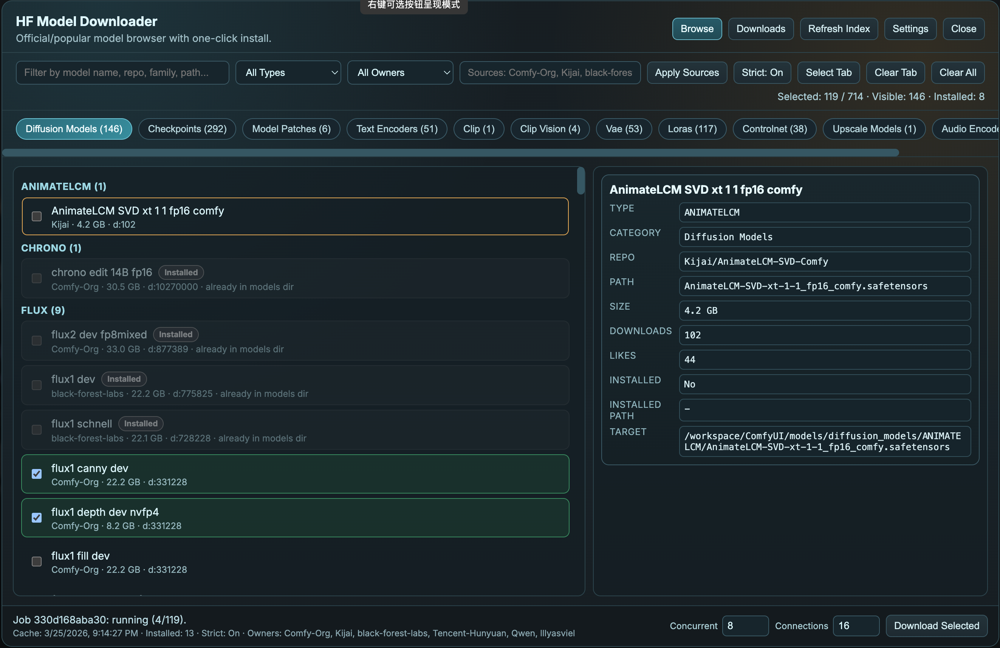

# ComfyUI HF Model Downloader

Curated Hugging Face model browser + installer for ComfyUI.

This extension adds a popup UI (opened from the ComfyUI sidebar) where you can browse official/popular models, filter them, select multiple files, and download directly into the correct Comfy model folders.

## What It Adds

- Sidebar launch button: `HF Models` (with floating fallback button if menu injection fails)
- Curated multi-owner index (default owners include Comfy-Org, Kijai, black-forest-labs, Tencent-Hunyuan, Qwen, lllyasviel)
- Tabbed browsing by Comfy model category
- Search + filters (family/type, owner, strict filtering toggle)
- Bulk selection and queue-based download with `aria2c`
- Per-file live progress (each model has its own line/progress/speed in the Downloads view)
- Automatic install path placement:
  - `ComfyUI/models/<category>/<family>/<filename>`
- Token settings panel for gated Hugging Face repos

## Requirements

- ComfyUI running locally
- `aria2c` installed and available in `PATH`
- Python environment used by ComfyUI

## Install

1. Place this folder in:
   - `ComfyUI/custom_nodes/ComfyUI_HF_ModelDownloader`
2. Restart ComfyUI.
3. Hard refresh browser (`Ctrl+Shift+R`).
4. Open `HF Models` from the ComfyUI sidebar.

## Quick Start

1. Open `HF Models`.
2. Click `Refresh Index` (optional, to pull latest curated list).
3. Pick a category tab (for example `diffusion_models`, `loras`, `vae`).
4. Filter by search / family / owner as needed.
5. Select models and click `Download Selected`.
6. Watch per-file progress in the `Downloads` view.

## Token for Gated Repos

Use the popup `Settings` button to save your Hugging Face token.

- `Save Token` validates token against HF before saving.
- `Clear` removes saved token file.
- UI shows masked token + source.

Token resolution order used by backend:

1. `./.hf_token` in this extension folder
2. `/workspace/mod/.hf_token`
3. `HF_TOKEN` / `HUGGINGFACE_TOKEN` environment variables

## Download + Progress Behavior

- Downloader uses `aria2c` in queue mode.
- Jobs support:
  - start
  - polling status
  - cancel
- Progress sources:
  - primary: aria2 JSON-RPC (per-file bytes/speed/progress)
  - fallback: local file-size snapshots when RPC data is unavailable

## Filtering Behavior

`Strict` mode is designed to reduce junk entries:

- excludes shard artifacts (`00001-of-00002` style files)
- excludes diffusers internals/components that are not direct model weights
- applies minimum size heuristics by category

Turn `Strict` off if you want wider/raw file visibility.

## API Routes

All routes are served by this extension:

- `GET /hf-model-downloader/index`
- `POST /hf-model-downloader/download`
- `GET /hf-model-downloader/status`
- `GET /hf-model-downloader/jobs`
- `POST /hf-model-downloader/cancel`
- `GET /hf-model-downloader/settings`
- `POST /hf-model-downloader/token`

## Troubleshooting

- No sidebar button:
  - hard refresh browser
  - check floating `HF` button fallback
- Gated repo download fails with auth error:
  - open `Settings` and save a valid HF token
- Download fails immediately:
  - ensure `aria2c` is installed and in `PATH`
- Model appears already installed incorrectly:
  - installed detection uses filename + size heuristics; refresh index after manual file changes

## Notes

- This extension is UI/API focused and does not register graph node classes.
- Frontend assets are served from `./web`.
